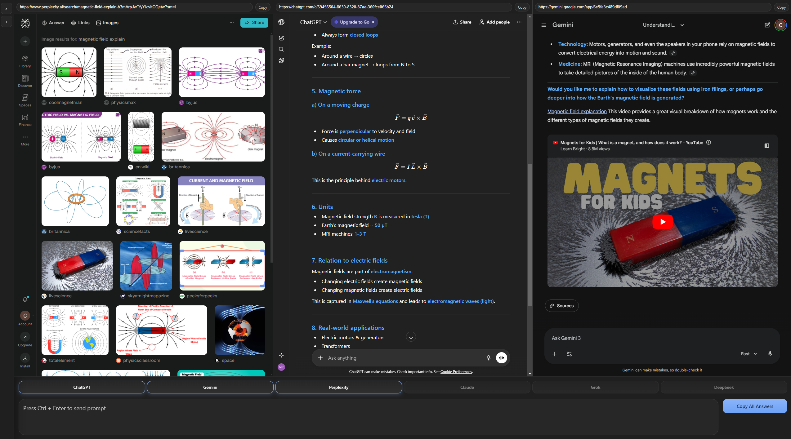

# LLM-God

## Screenshot

This is a desktop app for Windows machines only (currently) that allows users to simultaneously prompt multiple LLM's at once in one environment. I use this app every day, for coding or non coding purposes. It has saved me countless hours of copypasting and is just so much more efficient.

Currently, the following LLM web interfaces are supported:

- ChatGPT
- Google Gemini
- Anthropic Claude
- Perplexity
- X.ai Grok
- DeepSeek

## Downloading the App for Personal Use

Go to the Releases section, and download the Setup.exe. It is going to say that Microsoft has flagged this as untrusted. Windows codesigning has not been done yet, so for now, ignore the warning and proceed to installation.

The app should open immediately after you bypass the warning and you can add the desktop shortcut to your computer!

## Key Features & Usage

### 🚀 Simultaneous Prompting
Type your prompt once and hit `Ctrl + Enter` to send it to all active LLMs instantly.

### ✨ Global "Magic" Copy (Ctrl + Q)
Found some code or text you want to ask about?
- Press `Ctrl + Q` anywhere in Windows (even outside the app).
- The app will instantly grab the selected text, bring LLM-God to the foreground, and prepare it as your prompt.

### 📄 File Drag & Drop
Simply drag and drop files into the prompt area to broadcast them to all active providers. The app automatically handles text extraction or native file attachment depending on the provider's capabilities.

### 📋 Copy All Answers
Click the **"Copy All Answers"** button to aggregate responses from all providers and copy them to your clipboard in a clean, readable format.

### 🌙 Dark Mode
LLM-God forces the embedded Chromium engine into dark mode, so each LLM website sees `prefers-color-scheme: dark` and automatically renders its dark theme when available.
